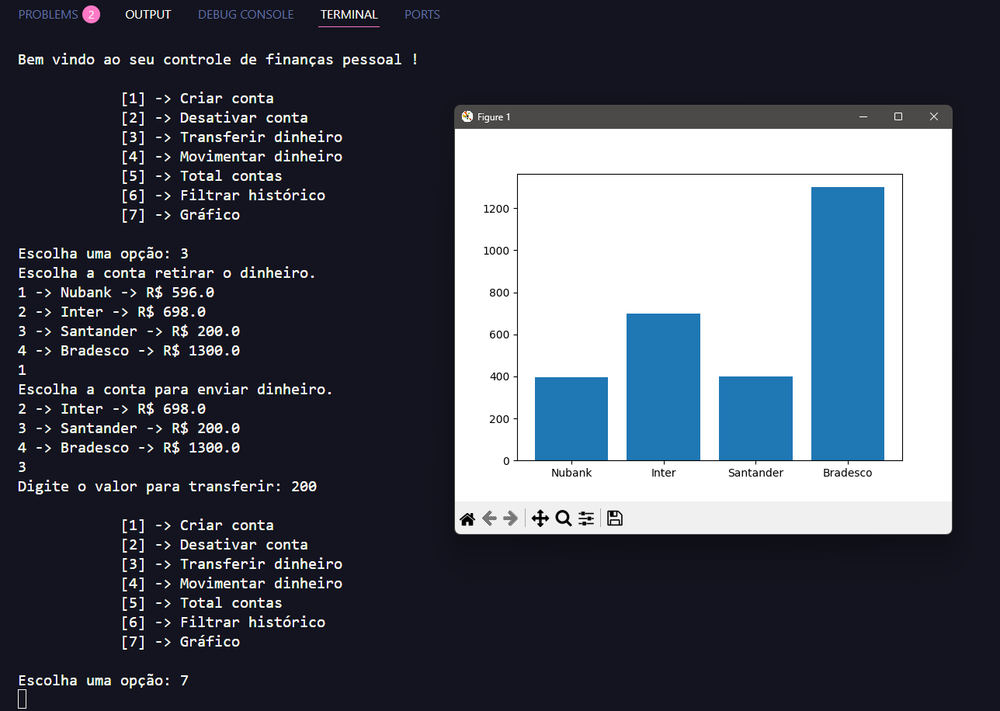

# 📊 Sistema de Gerenciamento de Finanças Pessoais

Este é um projeto desenvolvido para aplicar conhecimentos sobre **ORM SQLModel** e o banco **SQLite**. Ele permite a gestão de finanças pessoais, incluindo um **CRUD** para contas bancárias.

### Interface 



## 🚀 Tecnologias Utilizadas
- **Python** 🐍
- **SQLModel** 🗄️
- **SQLite** 🏦
- **Matplotlib** 📊 (para geração de gráficos)

## 🔧 Funcionalidades
- Criar contas bancárias 🏦
- Desativar contas ❌
- Transferir saldo entre contas 🔄
- Movimentar dinheiro 💰
- Consultar saldo total 📈
- Filtrar histórico de transações 📅
- Gerar gráficos de saldo por banco 📊

## 📂 Estrutura do Projeto
```
📁 projeto-financas
│── model.py        # Definição dos modelos e banco de dados
│── view.py         # Funções de manipulação dos dados
│── template.py     # Interface interativa no terminal
│── database1.db    # Banco de dados SQLite
```

## 🛠️ Como Executar
1. Clone este repositório:
   ```bash
   git clone 
   ```
2. Acesse o diretório do projeto:
   ```bash
   cd projeto-financas
   ```
3. Instale as dependências:
   ```bash
   pip install -r requirements.txt
   ```
4. Execute o script principal:
   ```bash
   python template.py
   ```

## 🎯 Exemplos de Uso
### Criar uma Conta
```
[1] -> Criar conta
Digite o nome de algum dos bancos abaixo:
---Nubank---
---Santander---
---Inter---
Digite o banco: Nubank
Digite o valor inicial: 1000
Conta criada com sucesso! ✅
```

## 🧑‍💻 Desenvolvedor  
Feito por Kayque de Jesus

